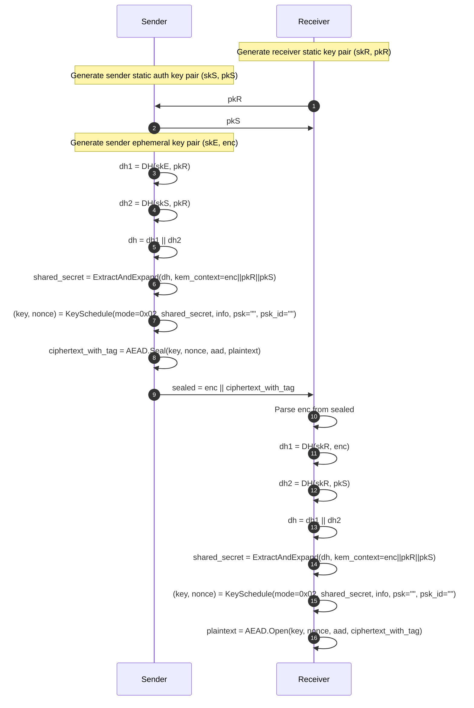

# Architecture Overview

## Overview
This project demonstrates HPKE v1 **Auth mode** (RFC 9180) in C# on .NET 10 with NSec.Cryptography. It is intentionally instrumented to print private keys, shared secrets, and derived values so the full protocol flow is easy to inspect.

This project is **not** production-ready cryptographic software.

## Standards Reference
- RFC 9180 (Hybrid Public Key Encryption): https://datatracker.ietf.org/doc/html/rfc9180

## Selected HPKE Ciphersuite
- KEM: DHKEM(X25519, HKDF-SHA256), `kem_id = 0x0020`
- KDF: HKDF-SHA256, `kdf_id = 0x0001`
- AEAD: AES-256-GCM, `aead_id = 0x0002`
- Mode: Auth, `mode = 0x02`

## High-Level Data Flow

## Auth Mode KEM Derivation Details
Per RFC 9180 DHKEM Auth semantics:

1. `dh1 = DH(skE, pkR)`
2. `dh2 = DH(skS, pkR)`
3. `dh = dh1 || dh2`
4. `eae_prk = LabeledExtract("", "eae_prk", dh)`
5. `kem_context = enc || pkR || pkS`
6. `shared_secret = LabeledExpand(eae_prk, "shared_secret", kem_context, Nsecret)`

Receiver computes the mirrored operations:

- `dh1 = DH(skR, enc)`
- `dh2 = DH(skR, pkS)`

with the same concatenation order and KEM context order.

## Auth Mode Key Schedule
With empty `psk` and empty `psk_id`:

1. `psk_id_hash = LabeledExtract("", "psk_id_hash", psk_id)`
2. `info_hash = LabeledExtract("", "info_hash", info)`
3. `key_schedule_context = mode || psk_id_hash || info_hash`
4. `secret = LabeledExtract(shared_secret, "secret", psk)`
5. `key = LabeledExpand(secret, "key", key_schedule_context, Nk)`
6. `nonce = LabeledExpand(secret, "nonce", key_schedule_context, Nn)`

For this ciphersuite:
- `Nk = 32`
- `Nn = 12`

## Message Format
Transmitted output:

- `sealed = enc || ciphertext_with_tag`

The nonce is derived from HPKE key schedule material and is not transmitted.

## Security Considerations
- This demo intentionally prints private keys and secrets for educational traceability.
- No formal security audit is claimed.
- Do not treat this code as hardened production cryptography.

## AI Usage Disclosure
AI tools may have been used to generate or refine code and documentation. Independent standards conformance checks and expert security review are required before production use.
