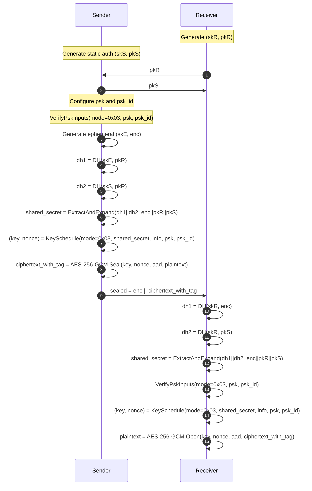

# Architecture Overview: HPKE Auth+PSK Demo

## Overview
This project demonstrates RFC 9180 HPKE v1 **Authenticated + PSK mode** (`mode = 0x03`) with explicit, traceable steps.

Core HPKE components:

- KEM: derives a shared secret from asymmetric Diffie-Hellman operations
- KDF: applies RFC 9180 labeled HKDF domain separation
- AEAD: encrypts/decrypts payload with derived key and nonce

RFC reference: https://datatracker.ietf.org/doc/html/rfc9180

## Ciphersuite and Sizes
Per RFC 9180 Sections 7.1, 7.2, and 7.3:

- `kem_id = 0x0020` → DHKEM(X25519, HKDF-SHA256)
- `kdf_id = 0x0001` → HKDF-SHA256
- `aead_id = 0x0002` → AES-256-GCM

AEAD parameters:

- `Nk = 32` bytes
- `Nn = 12` bytes
- `Nt = 16` bytes

Suite identifiers:

- `suite_id = "HPKE" || I2OSP(kem_id,2) || I2OSP(kdf_id,2) || I2OSP(aead_id,2)` (RFC 9180 Section 5)
- `kem_suite_id = "KEM" || I2OSP(kem_id,2)` (RFC 9180 Section 4.1)

## Auth+PSK Mode Flow (RFC 9180)
Authenticated DHKEM and PSK-aware key schedule are both used.

### Authenticated DHKEM (two DH values)
RFC 9180 authenticated KEM uses the sender static authentication key in addition to sender ephemeral key.

Sender:
1. `dh1 = DH(skE, pkR)`
2. `dh2 = DH(skS, pkR)`
3. `dh = dh1 || dh2` (ordering is mandatory)
4. `eae_prk = LabeledExtract("", "eae_prk", dh)`
5. `kem_context = enc || pkR || pkS` (ordering is mandatory)
6. `shared_secret = LabeledExpand(eae_prk, "shared_secret", kem_context, Nsecret)`

Receiver mirrors this exactly:
1. `dh1 = DH(skR, enc)`
2. `dh2 = DH(skR, pkS)`
3. same `dh = dh1 || dh2`
4. same ExtractAndExpand and `kem_context`

### PSK-aware key schedule (`mode = 0x03`)
RFC 9180 Section 5.1:

1. `psk_id_hash = LabeledExtract("", "psk_id_hash", psk_id)`
2. `info_hash = LabeledExtract("", "info_hash", info)`
3. `key_schedule_context = mode || psk_id_hash || info_hash`
4. `secret = LabeledExtract(shared_secret, "secret", psk)`
5. `aead_key = LabeledExpand(secret, "key", key_schedule_context, Nk)`
6. `aead_nonce = LabeledExpand(secret, "nonce", key_schedule_context, Nn)`

### PSK input validation
`VerifyPskInputs(mode, psk, psk_id)` enforces RFC 9180 Section 5.1 constraints:

- Modes `0x01` and `0x03`: `psk` and `psk_id` must be non-empty.
- Modes `0x00` and `0x02`: `psk` and `psk_id` must be empty.

## Message Format
Transmitted output format:

- `sealed = enc || ciphertext_with_tag`

The nonce is derived by key schedule and not transmitted (RFC 9180 Section 5.2 context for base nonce usage).

## Sequence Diagram (Auth+PSK)


## KeySchedule Flowchart
```mermaid
flowchart TD
    A[Inputs: mode=0x03, shared_secret, info, psk, psk_id] --> B[VerifyPskInputs]
    B --> C[psk_id_hash = LabeledExtract('', 'psk_id_hash', psk_id)]
    C --> D[info_hash = LabeledExtract('', 'info_hash', info)]
    D --> E[key_schedule_context = mode || psk_id_hash || info_hash]
    E --> F[secret = LabeledExtract(shared_secret, 'secret', psk)]
    F --> G[aead_key = LabeledExpand(secret, 'key', key_schedule_context, Nk)]
    F --> H[aead_nonce = LabeledExpand(secret, 'nonce', key_schedule_context, Nn)]
    G --> I[AEAD key material]
    H --> J[AEAD nonce material]
```

## Security Considerations
- This demo is educational and prints secrets for learning.
- It is not hardened, not audited, and not suitable for production.
- Side-channel resistance and misuse resistance are not guaranteed.

## AI Usage Disclosure
AI tools may have been used to draft or refine this implementation and documentation. Independent verification against RFC 9180 and professional security review are required before any production deployment.
