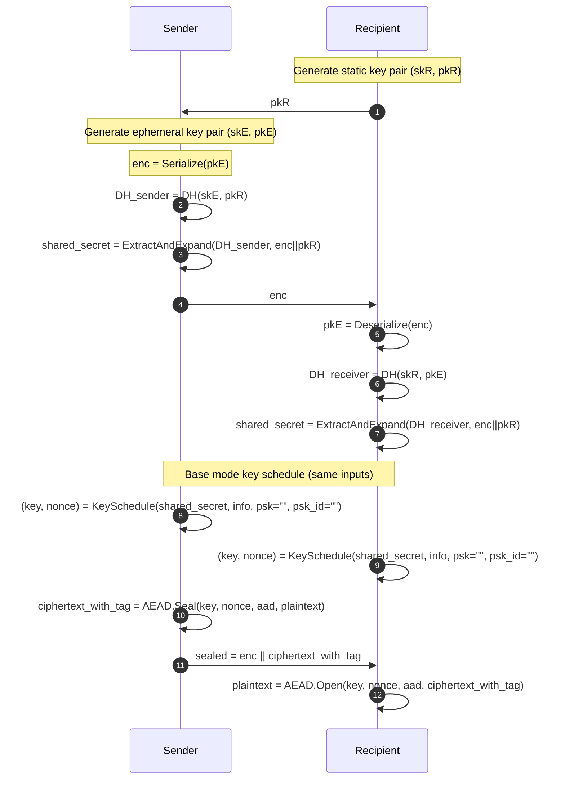
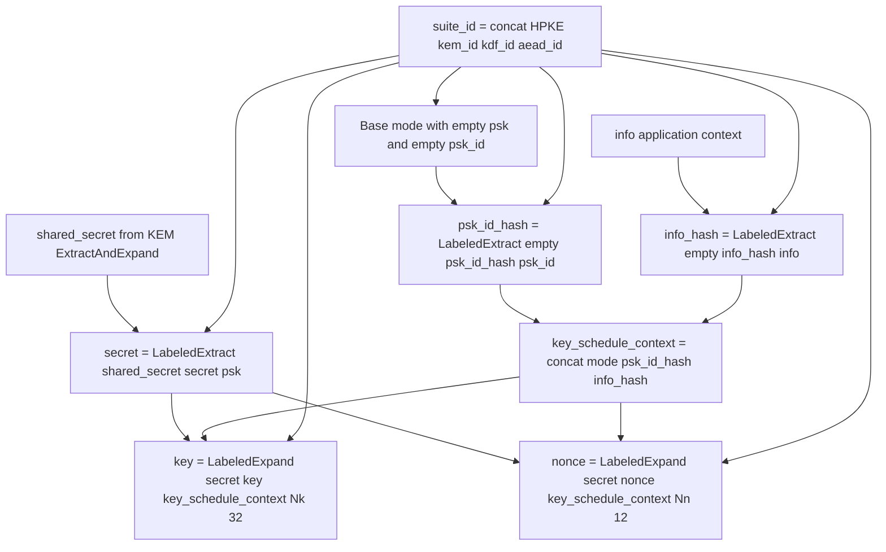
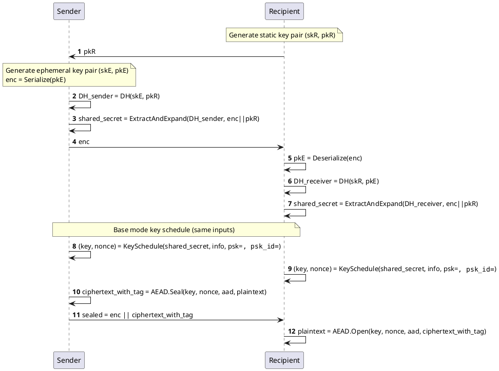
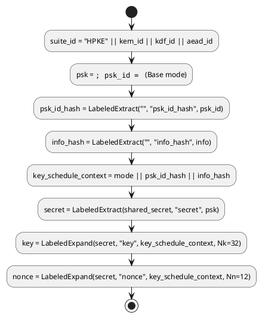

# Architecture Overview

## Overview
This repository is an educational demonstration of HPKE v1 Base Mode (RFC 9180) implemented in C# on .NET 10 using NSec.Cryptography. It is intentionally instrumented to print private keys, shared secrets, and derived values so learners can inspect each stage.

This project is **not** production-ready cryptographic software.

## Standards Reference
- RFC 9180 (Hybrid Public Key Encryption): https://datatracker.ietf.org/doc/html/rfc9180

## Selected HPKE Ciphersuite
This demo uses the RFC 9180 ciphersuite:

- KEM: DHKEM(X25519, HKDF-SHA256), `kem_id = 0x0020`
- KDF: HKDF-SHA256, `kdf_id = 0x0001`
- AEAD: AES-256-GCM, `aead_id = 0x0002`

## High-Level Data Flow

## Key Schedule
For this ciphersuite, the AEAD output sizes are:

- `Nk = 32` bytes (AES-256-GCM key)
- `Nn = 12` bytes (AES-GCM nonce)

## Message Format
The transmitted sealed message is:

- `sealed = enc || ciphertext_with_tag`

Where:

- `enc` is the sender ephemeral public key encoding (`pkE`)
- `ciphertext_with_tag` is AES-256-GCM output (ciphertext + authentication tag)
- The AEAD nonce is **derived** from the HPKE key schedule and is not transmitted on the wire

In this demo, derived nonce values may be printed for debugging/learning visibility.

## Security Considerations
- The demo prints private keys and secret material; this is intentionally insecure for learning.
- The implementation has no formal audit and should not be treated as hardened cryptographic code.
- Risks include side-channel leakage, API misuse, and accidental secret exposure through logs/output.
- This repository is not intended for production deployment.

## AI Usage Disclosure
AI tools may have been used to generate or refine parts of the code and documentation in this repository. Users are responsible for independently verifying correctness, standards conformance, and security properties. Cryptographic implementations require expert review before any real-world use.

## Appendix (Optional)
Optional (requires rendering): PlantUML equivalents of the diagrams above.

### Sequence Diagram (PlantUML)

### Key Schedule Flow (PlantUML)

