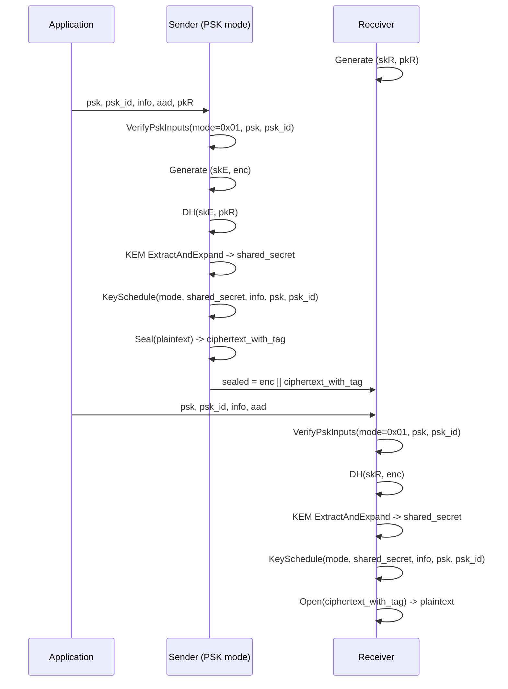

# HPKE.Mode.PSK Architecture

## Overview

`HPKE.Mode.PSK` is a linear educational console demo of RFC 9180 HPKE v1 in PSK mode (`mode = 0x01`).

Main components (RFC 9180):
- KEM: DHKEM over X25519 (RFC 9180 Section 4.1)
- KDF: HKDF-SHA256 with HPKE labeled functions (RFC 9180 Section 4)
- AEAD: AES-256-GCM (RFC 9180 Sections 5.2 and 7.3)

## Fixed ciphersuite and parameters

- `kem_id = 0x0020` (DHKEM(X25519, HKDF-SHA256), RFC 9180 Section 7.1)
- `kdf_id = 0x0001` (HKDF-SHA256, RFC 9180 Section 7.2)
- `aead_id = 0x0002` (AES-256-GCM, RFC 9180 Section 7.3)
- `Nk = 32`, `Nn = 12`, `Nt = 16`

Derived identifiers:
- `suite_id = "HPKE" || I2OSP(kem_id,2) || I2OSP(kdf_id,2) || I2OSP(aead_id,2)` (RFC 9180 Section 5)
- `kem_suite_id = "KEM" || I2OSP(kem_id,2)` (RFC 9180 Section 4.1)

## PSK mode flow (SetupPSKS / SetupPSKR)

1. Receiver creates static key pair `(skR, pkR)`.
2. Application provides non-empty `psk` and non-empty `psk_id`.
3. Sender creates ephemeral key pair `(skE, enc)` where `enc = SerializePublicKey(pkE)`.
4. Sender computes DHKEM shared secret using `DH(skE, pkR)` and KEM `ExtractAndExpand` (RFC 9180 Section 4.1).
5. Sender runs `KeySchedule(mode=0x01, shared_secret, info, psk, psk_id)` (RFC 9180 Section 5.1).
6. Sender seals plaintext with AES-256-GCM using derived key/nonce.
7. Sender sends `sealed = enc || ciphertext_with_tag`.
8. Receiver computes DHKEM shared secret using `DH(skR, enc)` and the same KEM `ExtractAndExpand`.
9. Receiver runs the same key schedule with identical `mode`, `info`, `psk`, `psk_id`.
10. Receiver opens ciphertext and verifies plaintext.

## PSK input validation (RFC 9180 Section 5.1)

The demo includes a `VerifyPskInputs(mode, psk, psk_id)` helper that enforces RFC rules:
- For PSK modes (`0x01` or `0x03`): `psk` and `psk_id` must be provided and non-empty.
- For non-PSK modes (`0x00` or `0x02`): both must be empty.

This prevents accidental use of invalid mode/input combinations.

## KeySchedule details for mode 0x01

Per RFC 9180 Section 5.1:

- `psk_id_hash = LabeledExtract("", "psk_id_hash", psk_id)`
- `info_hash   = LabeledExtract("", "info_hash", info)`
- `key_schedule_context = mode || psk_id_hash || info_hash`
- `secret = LabeledExtract(shared_secret, "secret", psk)`
- `aead_key   = LabeledExpand(secret, "key", key_schedule_context, Nk)`
- `aead_nonce = LabeledExpand(secret, "nonce", key_schedule_context, Nn)`

Labeled KDF primitives follow RFC 9180 Section 4 exactly:
- `LabeledExtract(salt, label, ikm) = HKDF-Extract(salt, "HPKE-v1" || suite_id || label || ikm)`
- `LabeledExpand(prk, label, info, L) = HKDF-Expand(prk, I2OSP(L,2) || "HPKE-v1" || suite_id || label || info, L)`

## Message format

The transmitted payload format is:

- `sealed = enc || ciphertext_with_tag`

`enc` is the sender ephemeral public key encoding from DHKEM (RFC 9180 Section 4.1).
Nonce is not transmitted in this single-shot demo because both sides derive it from key schedule output.

## Sequence diagram



## KeySchedule flowchart

```mermaid
flowchart TD
    A[Inputs: mode, shared_secret, info, psk, psk_id] --> B[VerifyPskInputs per RFC 9180 Sec 5.1]
    B --> C[psk_id_hash = LabeledExtract("", "psk_id_hash", psk_id)]
    B --> D[info_hash = LabeledExtract("", "info_hash", info)]
    C --> E[key_schedule_context = mode || psk_id_hash || info_hash]
    D --> E
    E --> F[secret = LabeledExtract(shared_secret, "secret", psk)]
    F --> G[aead_key = LabeledExpand(secret, "key", key_schedule_context, Nk)]
    F --> H[aead_nonce = LabeledExpand(secret, "nonce", key_schedule_context, Nn)]
```

## Security considerations

- This is educational demo code, not production-ready.
- The sample deliberately prints private keys and secrets for traceability.
- Real implementations require robust key lifecycle management, secure memory handling, replay protection strategy, and protocol integration hardening.

## AI usage disclosure

Some content may be AI-assisted.
Independent expert cryptographic review is required before any real-world use.
